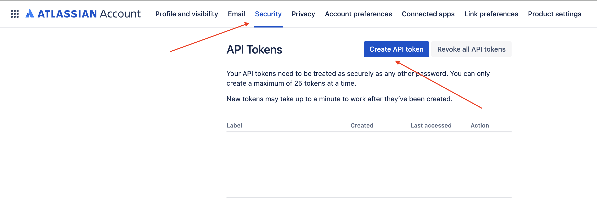

# Jira Release Commits / Repositories

This CLI tool helps you retrieve information about commits and repositories associated with a specific JIRA fix version. It works by fetching JIRA tickets for a given fix version and then retrieving all related commits from Bitbucket. The tool is designed for Leads, Architects, and Project Managers to identify repositories affected by a particular release or to generate a list of commits for creating RC branches.
Example:
```
Fetching tickets for fixVersion: 1.0.0...

Team: Team A
  repository1
  repository2
  ...
Team: Team B
  repository2
  ...
```

## Features

- Fetch Jira tickets by a specific fix version.
- Retrieve commits information related to each ticket from Bitbucket.
- Format and output ticket and commit information in a structured format.
- Output results to the console or save to a file.
- Customize the report to show repositories, commits, or group by user story.

## To-Do
- [ ] Check for commits in subtasks.

## Requirements

Node.js must be installed on your system to use this tool.

## Installation

1. **Get JIRA API key**

   Navigate to your Atlassin [Account settings](https://id.atlassian.com/manage-profile/security) and create API Token:
   
   
2. **Install dependencies**
   ```bash
   npm install
   ```
3. **Setup environment variables**
   
   Create a `.env` file in the root directory of the project and add your Jira credentials:
   ```bash
   JIRA_URL=<your-jira-url>
   JIRA_USERNAME=<your-jira-username>
   JIRA_TOKEN=<your-jira-token>
   ```

## Usage

### Command-Line Options
| Option            | Alias | Description                                                    | Default       |
|-------------------|-------|----------------------------------------------------------------|---------------|
| `--fixVersion`    | `-f`  | The fix version to search for in Jira. **(required)**          | N/A           |
| `--output-file`   | `-o`  | The file to write the output to.                               | Not specified |
| `--report-type`   | `-r`  | Report type. Choose between `"repositories"` or `"commits"`.   | `"repositories"` |
| `--show-stories`  | `-s`  | Group commits/repositories by user story.                      | `false`       |

## Examples
1. Fetch tickets and show related commits grouped by user story:
  ```bash
  node main.js -f "1.0.0" -r "commits" -s
  ```
  Result:
  ```
  Team: Team A
    User Story 1
      repository1
        [COMMIT HASH] Commit Message
        [COMMIT HASH] Commit Message
      repository2
        [COMMIT HASH] Commit Message
        [COMMIT HASH] Commit Message
    User Story 2
      repository1
        [COMMIT HASH] Commit Message
        [COMMIT HASH] Commit Message
  ```
2. Fetch tickets and show affected repositories:
  ```bash
  node main.js -f "1.0.0" -r "repositories"
  ```
  Result:
  ```
  Team: Team A
    repository1
    repository2
    repository3
  Team: Team B
    repository2
  ```
3. Fetch tickets and save the report to a file:
  ```bash
  node main.js -f "1.0.0" -o "report.txt"
  ```
